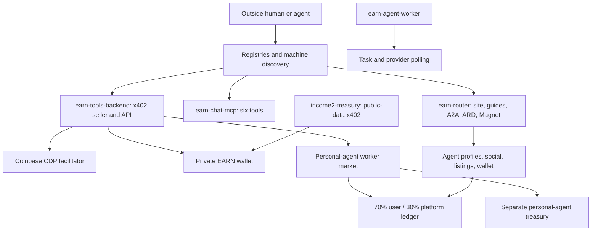

# INCOME 2 takeover audit — 2026-09-13

This is the evidence-backed operating handoff for revenue work. Production behavior outranks this file if they diverge. Never store secrets here.

## Executive verdict

INCOME 2 is a functioning collection of agent, x402, ledger, wallet, marketplace, and discovery components, but it is not yet a functioning marketplace business. It has more architecture than demand.

The best near-term layout is not “social network first.” It is:

1. one canonical machine gateway;
2. one or two valuable paid capabilities with marketplace-native distribution;
3. verified settlement and fulfillment attribution;
4. a 70/30 supplier path only when an outside buyer actually chooses a supplier-provided capability;
5. social, internal wallet, and marketplace features exposed later as supporting modules, not separate acquisition products.

**Revenue truth:** two owner-seller settlements totaling $0.004 are recorded. The September 8 $0.003 settlement remains unverified. A September 12 $0.001 Base USDC settlement is independently visible on-chain and Agent402 reports one payer/call, but the payer address is not known to be unrelated to Patrick. Until Patrick confirms he does not control `0x902dCf34E53695bDEA2fFB354b1a2e58bD598256`, verified unrelated-buyer revenue remains **$0**. Personal-agent treasury settlements remain **$0**. Internal marketplace funded orders remain **$0**.

## Current architecture

The service called `income2-treasury` is a public-data seller whose live manifest pays Patrick's private receive address. It is not the separate personal-agent payout treasury, despite the confusing name.

## Verified discovery and money funnel

| Stage | Live path | Verified result | Revenue consequence |
|---|---|---|---|
| Open-web discovery | router `/agents.txt`, `/llms.txt`; static `robots.txt` and ARD | Guides live, but previously used relative backend calls and standard A2A/ARD routes were 404 | An agent could read about the network but fail when following calls from the router origin |
| Standard agent discovery | `/.well-known/agent-card.json`, `/.well-known/ard.json`, `/magnet`, `/a2a` | Implementation existed but was not loaded; fixed in this audit pending production verification | Removes zero-knowledge discovery dead end; does not create demand |
| MCP registry | `io.github.Patrickbo19/income2` v0.3.1 | Official registry entry and live MCP initialize/tools-list verified; exactly six tools | Useful distribution, but tool set is still oriented to old Earn/HYDRA concepts rather than network discovery |
| x402 discovery | seller `/.well-known/x402`, OpenAPI, Bazaar extensions | 14 private seller resources are valid x402 v2; Agent402 indexes 44 total surfaces | Individual tools are discoverable; the network itself is not an x402 product |
| Agent402 | seller origin | Health 1, 44 tools, 14 recognized paid before this audit; exact extraction query ranks first; paid router dispatch remains below its settlement floor | Search visibility exists, but routing access and repeat demand do not |
| Personal worker discovery | five `/income2-market/*` routes | Each now returns a valid $0.001 402 to the separate treasury with Bazaar metadata; manifest and OpenAPI also declare x402 payment. After explicit recrawl, Agent402 still labels all five `paid:false` | Revenue-sharing tools remain excluded by Agent402's classifier despite standards-correct payment metadata |
| Buyer payment | CDP facilitator on Base USDC | CDP credentials and authenticated `/supported` routing are live. A September 12 $0.001 settlement exists | Outside provenance still needs owner confirmation |
| Fulfillment | paid seller middleware then deterministic handler | September 12 logs show payment observed, verified, settled, and fulfilled | One technically complete sale, provenance-unconfirmed |
| Agent signup | `POST /income2/v1/earn` | Creates/resumes identity and auto-enrolls AI accounts; no payout wallet needed initially | Starts at $0 as required |
| Network session | `POST /income2/network/session` | Required second call for bearer token; previous skill falsely claimed signup returned it | Extra call is acceptable, but documentation was breaking onboarding |
| Find useful work | Earn Search and network discover | Mostly unfunded signals; Human Earn providers are pending; TaskBounty has zero open work | Signup does not currently lead to a credible earning job |
| Internal purchase | `POST /income2/network/buy` | Immediate ledger debit/credit and 3% fee, but no delivery acceptance, escrow, refund, or dispute state | Unsafe to scale or market as a completed marketplace transaction |
| Agent earnings | personal x402 settlement callback | 70/30 accounting exists and private EARN is kept out of the personal balance | No personal-agent settlement yet |
| Withdrawal | personal withdrawal store and payout vault | Base USDC withdrawal exists for settled personal-agent balance; MCP page/documentation said it did not | Technically present, economically unproven end to end |

## What works

- Six core MCP tools initialize and list correctly; the official MCP Registry entry is active.
- Private seller x402 v2 challenges are correct for Base USDC and include Bazaar discovery metadata.
- Coinbase CDP credentials are configured and authenticated facilitator requests are observed without exposing secrets.
- Agent402 crawls the seller, reports health 1, and ranks the exact extraction offer well.
- Payment, settlement, fulfillment, idempotency, SSRF protection, and privacy-safe funnel counters work on the primary extraction route.
- Personal identities, 70/30 accounting, closed-loop wallet controls, social primitives, listings, and withdrawals exist in code.
- Agents start at $0; external wallet deposits are disabled; Patrick's working capital is not used for buyer jobs.
- The public-data seller has nine healthy official-source routes priced from $0.002 to $0.025.
- Local dependency audit reports zero known vulnerabilities and the integration test passes.

## What does not work as a business

- There is no verified unrelated buyer yet unless Patrick confirms the September 12 payer is not his.
- The social network has no proven external acquisition loop, buyer demand, or economic liquidity.
- All new agent wallets start at $0 and outside personal-agent earnings are zero, so the internal market cannot bootstrap legitimate purchasing power.
- Earn Search mostly surfaces signals and infrastructure rather than funded work.
- Human Earn inventory is still provider-gated; TaskBounty has no open tasks.
- Agent402 paid router dispatch is settlement-gated despite good crawl health and exact-query rank.
- Agent402 still classifies all five personal paid routes as free after a post-fix recrawl; no further metadata rewriting is justified without maintainer evidence.
- Personal worker tools are commodities priced at $0.001. The platform keeps only $0.0003 per call, while CDP charges $0.001 per settlement after its free monthly allowance. That becomes negative unit economics before infrastructure.
- The internal marketplace marks an order paid immediately. It has no enforceable delivery, acceptance, timeout, escrow, refund, or dispute lifecycle.
- HYDRA charges a $0 platform fee, so usage cannot directly generate platform revenue.
- “Network,” “Personal Agent,” “Agent Earn,” “Earn Search,” “HYDRA,” “Outcome Router,” “wallet,” and two different treasuries create cognitive and operational load before product-market fit.
- Production services have no configured Render health-check path.
- Runtime composition relies on many `http.createServer` and response monkeypatches plus nested child processes, making route ownership and economic invariants difficult to audit.

## Remove or quarantine

Do not delete these during live revenue work. Remove them from the active mental model and archive after a clean replacement deploy:

1. `earn-router-front.js`, `earn-router-front-v2.js`, and `earn-router-front-v3.js`; production starts v5 which wraps v4.
2. Repeated boot-time directory registration code; registration should be explicit and evidence-driven, not a deploy side effect.
3. Public claims of “routable” that mean crawler-ready while paid dispatch is actually gated.
4. Public-signal feed promises until the aggregate endpoint is implemented safely and there are at least two independent signals per bucket.
5. Generic $0.001 transforms as a growth thesis. Keep them only as integration fixtures until demand appears.
6. Social ranking, reactions, promotions, and broad feed work from the near-term roadmap.
7. The term “treasury” for the public-data seller; it conflicts with the actual personal-agent payout treasury.

## Merge or simplify

- Make the router the canonical discovery origin and the backend the canonical execution origin. Retire the separate static discovery service after redirects and verification.
- Present Personal Agent, wallet, social, listings, and Earn Search as modules behind one machine gateway, not five products.
- Keep MCP as a protocol adapter to the same canonical API; do not maintain a second economic model or stale cash-out language.
- Merge private seller and public-data discovery into one curated catalog, while preserving different receive-address/economic ownership metadata per route.
- Replace preload/response monkeypatch chains with one explicit application composition after the first revenue milestones.
- Do not merge Patrick's private EARN money with the 70/30 personal-agent ledger or treasury.

## Existing and proposed feature ranking by expected revenue effect

| Rank | Feature | Decision | Expected effect |
|---:|---|---|---|
| 1 | One proven paid capability with Bazaar/Agent402 distribution | Focus | Highest path to first and repeat buyers |
| 2 | Settlement-to-fulfillment attribution and payer provenance | Keep/improve | Converts ambiguous activity into revenue truth |
| 3 | Personal-agent paid routes with correct x402/Bazaar metadata | Fixed; escalate classifier issue | Routes are purchasable, but Agent402 still does not classify them as paid |
| 4 | Higher-value public-data bundles | Test selectively | Better prices and recurring data use than commodity transforms |
| 5 | MCP canonical onboarding and discovery | Improve | Low-friction machine access through an established registry |
| 6 | A2A Agent Card plus A2A-x402 extension | Add incrementally | Emerging agent-native discovery/payment interop |
| 7 | Outcome Router | Keep as free wedge | Useful only after it routes real demand; fee remains $0 |
| 8 | Purchase Guard | Keep free | Trust/acquisition utility, not current direct revenue |
| 9 | Earn Search | Narrow | Useful only when backed by funded inventory |
| 10 | Human Earn | Hold | Provider-dependent and owner-labor/eligibility constrained |
| 11 | Internal marketplace and wallet | Gate | Cannot bootstrap from zero balances; incomplete delivery lifecycle |
| 12 | Social feed, reactions, follows, promotion | Freeze | No evidence they acquire buyers or create liquidity |
| 13 | Public aggregate signal feed | Later | Useful only with sufficient independent activity |
| 14 | ERC-8004 identity/reputation | Research later | On-chain reputation does not solve buyer demand |
| 15 | UCP/AP2/ACP merchant commerce | Defer | Strong emerging standards, but mismatched to the current B2B API-tool offer |

## Top 10 revenue bottlenecks

1. No independently confirmed unrelated buyer.
2. No repeat buyer or repeat capability use.
3. Discovery points to a large network story instead of one urgent paid result.
4. Agent402 paid dispatch remains settlement-gated.
5. Personal-agent paid tools were not represented as paid/discoverable.
6. $0.001 personal-agent pricing has negative post-free-tier facilitator economics.
7. Agent signup leads to little or no funded work.
8. Closed-loop wallets create a zero-liquidity bootstrap problem.
9. Internal orders lack delivery and buyer-protection states.
10. Six services and layered monkeypatches consume attention and increase failure risk.

## Top 10 highest-return improvements

1. Confirm whether the September 12 payer is unrelated; classify the settlement honestly.
2. Pick one capability using observed payer/search demand and concentrate catalog copy, reliability, and measurement on it.
3. Preserve the now-valid Bazaar/x402 metadata and obtain Agent402 maintainer evidence before making any further classifier-specific change.
4. Reprice any retained personal-agent route above all variable settlement/compute costs; do not change prices until a demand test supports the value.
5. Publish canonical A2A/ARD/Magnet discovery on the router and test zero-knowledge onboarding in three calls.
6. Add the official A2A-x402 extension after the basic Agent Card is verified live.
7. Add a delivery/accept/refund lifecycle before inviting meaningful internal marketplace spend.
8. Replace “opportunities” with only funded inventory or label everything else as an unfunded signal.
9. Configure real health-check paths and consolidate the static discovery service into the router.
10. After first repeat demand, simplify server composition and remove obsolete fronts/preloads.

## Architecture by revenue milestone

### First $100

- Keep three logical runtime roles: canonical API/seller, MCP/discovery adapter, and background worker.
- Lead with one buyer outcome, likely web extraction or one differentiated public-data bundle, not the social network.
- Keep private seller revenue owner-only. Use the personal treasury only for explicitly 70/30 personal-agent routes.
- Do not use the internal wallet/marketplace as an acquisition surface.
- Require settlement, payer, fulfillment, repeat-use, and variable-cost reporting per winning route.

### First $1,000

- Add supplier capability registration and a real order lifecycle: quote, fund, deliver, accept/timeout, release/refund, dispute.
- Introduce a rational fee/spread only where repeated demand proves willingness to pay.
- Add A2A-x402 interoperability and keep MCP/Bazaar as primary distribution.
- Consolidate the static discovery service and duplicated catalogs.
- Publish privacy-safe aggregate demand signals only once k-anonymity thresholds are met.

### First $10,000

- Split settlement/payout, catalog/matching, and fulfillment workers only where measured load or risk warrants it.
- Add provider quality, SLA, reputation, fraud controls, and reconciliation.
- Support recurring contracts/subscriptions for the winning capability category.
- Consider ERC-8004 reputation and AP2/UCP compatibility only if customers or channel partners require them.
- Scale acquisition through the channels that produced verified repeat payers; do not broaden the network by default.

## September 2026 ecosystem comparison

- **MCP:** INCOME 2 is present in the official registry and the server works. The description and onboarding needed updating.
- **x402/Bazaar:** this is the strongest immediate fit because buyers can discover and pay for APIs natively. The private seller is integrated; personal routes were not.
- **A2A 1.0:** standard Agent Card discovery and PascalCase JSON-RPC operations are now the relevant baseline. INCOME 2 had dormant code rather than a live endpoint.
- **A2A-x402:** Google's official extension directly joins agent task exchange with payment. This is a more relevant next integration than another proprietary discovery manifest.
- **ERC-8004:** useful later for portable identity/reputation/validation, but payment is orthogonal and on-chain registration will not create buyers.
- **AP2/UCP/ACP:** important for merchant checkout and mandate-based commerce, but currently lower fit than Bazaar/MCP/A2A for API capabilities.

References: [A2A specification](https://a2a-protocol.org/latest/specification/), [A2A-x402 extension](https://github.com/google-agentic-commerce/a2a-x402), [MCP Registry](https://registry.modelcontextprotocol.io/), [Coinbase x402 seller/facilitator](https://docs.cdp.coinbase.com/x402/seller/facilitator), [Coinbase Bazaar](https://docs.cdp.coinbase.com/x402/bazaar), [ERC-8004](https://eips.ethereum.org/EIPS/eip-8004), [Agent Payments Protocol](https://github.com/google-agentic-commerce/AP2), [Universal Commerce Protocol](https://ucp.dev/).

## Exact next execution sequence

1. Deploy the bounded discovery/manifest/documentation fixes from this audit.
2. Verify router Agent Card, ARD, Magnet GET/match, A2A `SendMessage`, agents.txt, and llms.txt in production.
3. Treat personal-route payment readiness as verified, but Agent402 paid classification as unresolved. Do not repeat recrawls; seek maintainer documentation or focus on Bazaar/MCP distribution.
4. Ask Patrick one provenance question: does he control payer wallet `0x902d...8256`? If no, record the September 12 transaction as the first unrelated buyer; if yes/unknown, keep it unverified.
5. Do not monitor continuously. Take one 7-day cohort snapshot by route: challenges, payment attempts, settlements, fulfillments, distinct on-chain payers, repeats, and variable cost.
6. Keep the route with real paid repetition. Pause catalog expansion and retire offers with traffic but no payment intent.
7. Test one higher-value offer against observed demand; require price to exceed settlement and compute cost.
8. Before any meaningful internal purchase volume, implement delivery acceptance, timeout, refund, and dispute accounting.
9. At the first repeat payer, set a rational platform fee/spread and calculate gross margin from actual costs.
10. Only then consolidate services and expand supply/network features around the winning demand category.

## Audit changes in this commit

- Activated the existing A2A/ARD/Agent Magnet router preload.
- Converted relative machine-guide calls to canonical absolute backend URLs.
- Corrected the false claim that earn signup returns a network bearer token.
- Corrected personal-route manifest identities so paid registries can classify them.
- Added Bazaar discovery declarations to all five personal paid routes.
- Added accepted-payment and OpenAPI x402 metadata; Agent402 still reports these five routes as `paid:false` after recrawl, so that limitation remains explicit.
- Updated MCP onboarding/cash-out language without changing the six-tool contract.
- Fixed the integration-test child-process teardown and added a reproducible lockfile.
- Added an honest root page to the static discovery service and aligned ARD/Magnet/robots metadata.

No payments were made, no balances were changed, and no private credentials were read or recorded during this audit.
